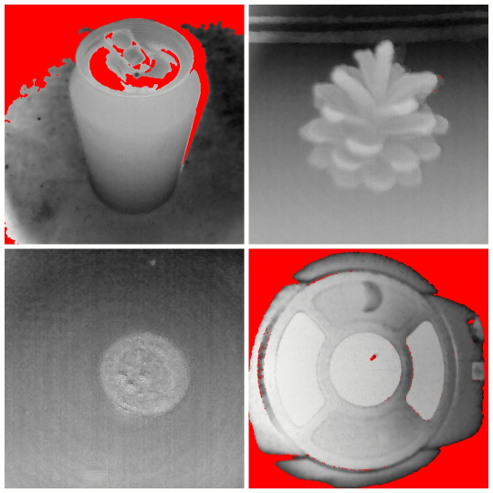

# Android Depth Camera Experiments

A couple of years ago I played with using an Intel Realsense camera on Android, coding to let me get the depth data into APDE and PyDroid3. That was fun, and quite successful, but it did mean having to attach the camera and a long USB cable to the phone. So I decided to buy a phone with a Time-of-Flight depth camera, to try out a more elegant and compact solution. That led to the experiments in this repository, which include APDE (like Processing for Android) code to capture depth data, as well as code in Processing, Python 3, Javascript and P5.js to work on the data saved in the APDE code.

x

## Examples of Depth Camera Data

Below are some examples of depth data captured using the code included here. Clockwise from top left we have a soda can, a small pine cone, a UK one pound coin and a lifebouy case fixed on a wall.

## Credits

This project is copyright 2021-2022 Andrew Thomas and is distributed under the GPL3 license.
