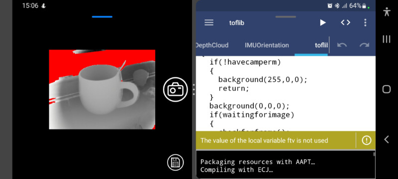

# A depth camera library for APDE

## Overview

Here you will find the code for the Time-of-Flight (ToF) depth camera library file and an example app for use with the APDE Android app. You should also be able to use it with Processing for Android, although you may need to make some changes. Plus, if you want to use the library file in AIDE or Android Studio, note that you should just need to rename it, from a pde to a java file extension, and use the APDE example to see how to use it. If you want to do that I'll assume you know what you're doing and won't provide any more info on it for now: APDE is an excellent way to code in Processing on an Android device, so this project is aimed at it for the acquisition of depth data.

The app/library will only work on devices that have a depth camera accessed through the Android Camera2 API. If you have problems there are plenty of Camera2 probing apps on the Android store that you can use to get more information. Some Android devices may not have full Camera2 implementations, so if you have a problem you could open an issue with relevant data. Also, the code has been tested on the devices below, so if you have a different device and it works, please open an issue with information on the Android device you've found to work. That way I can add it to the list to make life easier for other users.

* Samsung Galaxy S20 Ultra 5G

## Screenshot

Below is a screenshot of the APDE app running in their previewer. Note that if the Android device you use does not have a depth camera you should still see an example loaded from file, albeit without the camera and save buttons.

## Using the sample app

The first thing you need to do, if you haven't already, is install the APDE app on your Android device. Then, use a file explorer app to add a 'Sketchbook' folder to the root of your internal storage, if it's not already there (notice the upper-case S). Then copy the 'toflib' folder from here to your Sketchbook folder. Then in APDE you should be able to open the app like any other sketch. The included 'sketch.properties' file should ensure the previewer, or app, ask for camera permissions, but if you have problems try checking camera permission in the APDE settings.

You'll notice in the screenshot that there's a camera icon, which you can tap to get a depth image. Once you've got depth data the save icon should appear, which you can tap to save the raw depth and depth-confidence data to your Android device. The saved file will include some metadata, including orientation data so you can correct for camera angle later.

The files are saved in the external storage area for the app. So if you use APDE to run the app as an application, you should be able to find the files in '/Android/data/' followed by the package name you set in APDE. If you're running in the APDE previewer, you should look in '/Android/data/com.callsignlabs.apde.sketchpreview/files'. You'll probably want to move the files from there for accessing in other programs, using an app such as CX File Explorer.

## Credits

The time-of-flight code was put together using lots of sources to find out how to access the depth camera properly. That included the Android Developers web pages and, of course, Stack Overflow. However, special mention needs to go to Luke Ma whose attempts at accessing the camera in Java on a Samsung S10, which provided a lot of inspiration and hints that made this project a lot easier than it could have been ([click here to visit his Github page](https://github.com/plluke/tof)). Kudos to all of the sources of information, especially Luke!

This project is copyright 2021-2022 Andrew Thomas and is distributed under the GPL3 license.
