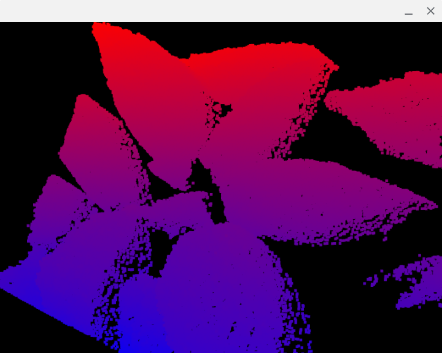

# Using Depth Camera Data in Processing on a PC

Here you can find a small Processing class for loading data files saved with the Android camera example. If you look at the global variables in tofloader.pde you'll see that, once the file is loaded, you can access not just the depth and depth-confidence data, but also the metadata it contains. Those metadata include the width, height, number of averages used, yaw, pitch, roll, sensor width (mm), sensor height (mm) and sensor focal length (mm).

As an example of the loader usage, the depthcamerapc.pde example loads a file from the data folder and converts it to a point cloud using the class in depthcloud.pde. The individual points are coloured to represent the depth-confidence values. If you look at the code for depthcloud.pde you'll see that you can do many operations on a point cloud once created, and you can see examples of usage in depthcloudpc.pde. The example displays the point cloud in a window in 3D and you can rotate the cloud by dragging your mouse over the window. And if you want to get a bit closer, or move out, you can use your + and - keyboard keys.

Here's a screenshot of the example showing a trimmed point cloud of a depth image of some leaves.

**Note:** You can use the loader and depth cloud code on Android, and probably with little effort in P5.js too. However, the amount of memory needed is too high for use in APDE, so depthcloudpc.pde isn't really suitable for use there.

## Credits

This project is copyright 2021-2022 Andrew Thomas and is distributed under the GPL3 license.
