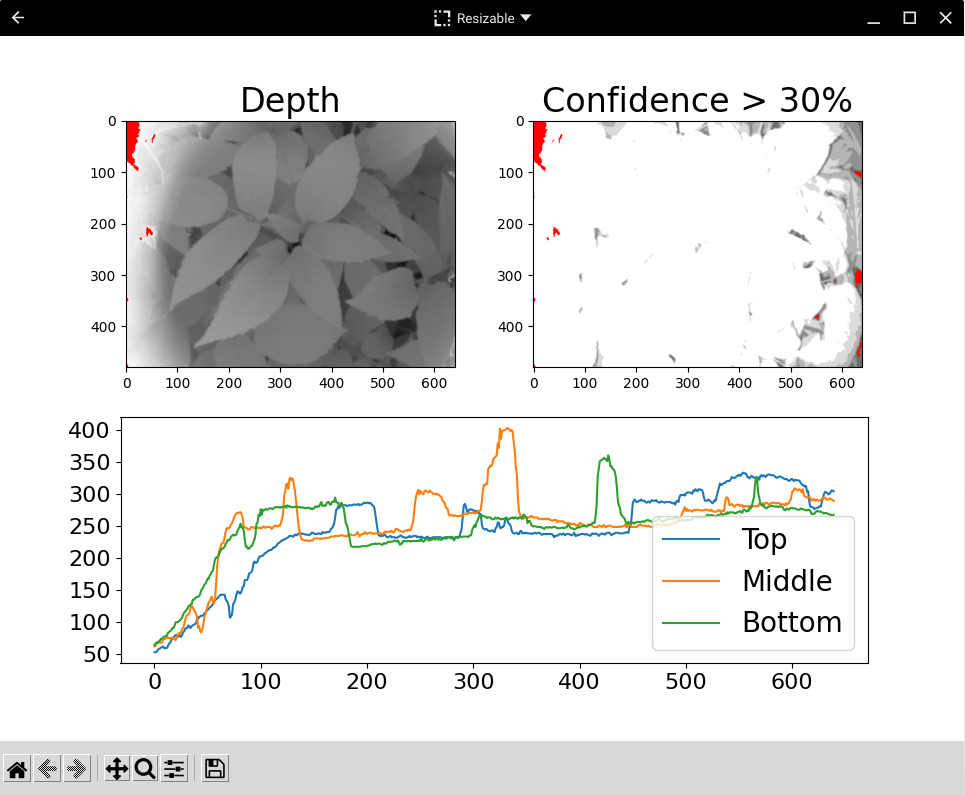
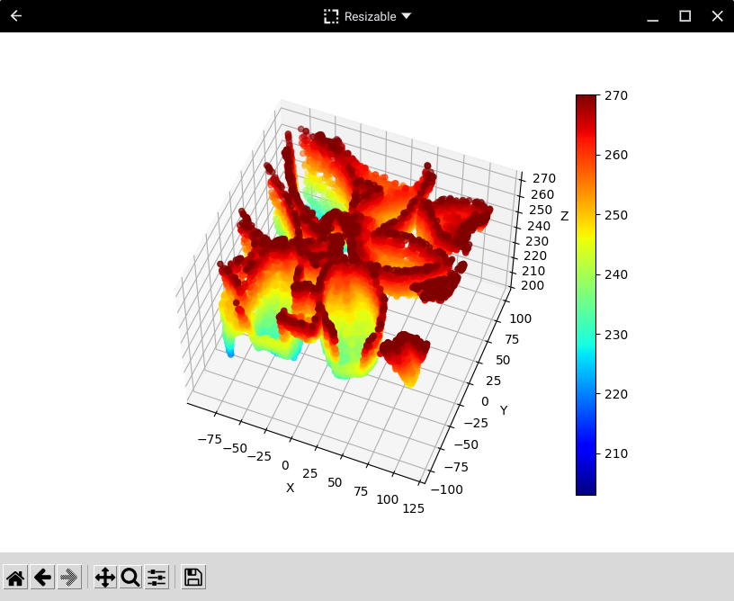

# Using Depth Camera data in Python 3 and PyDroid3

Here you will find a simple Python 3 library, with examples, for loading and using depth camera data saved into files using the Android APDE code. All of it was written in Python3 using PyDroid3 on an Android device, so you can use the code on a PC or Android. You can even run it on a Chromebook, either using Python 3 in a Linux container, or using the PyDriod3 Android app.

The library needs to be in a folder called 'depthcamera' in the same folder as your Python 3 code, as in this repository. That allows us to do things like 'from depthcamera import loader as ldr' when we want to use the library code. That makes life eaier for us as we can then do things like 'ldr.load_file("mydepthimage.dcam")' to load a file, and 'dep=ldr.get_depth()' to get a depth data frame. The library contains three Python files you can access that way, which are:

* **loader.py:** This file contains all the code needed to load all the data from a depth image file saved in the APDE Android example. It also has functions that let you access the depth and depth-confidence data, as well as all of the metadata.
* **depthframe.py:** This file has functions that let you do things like getting the depth limits and getting horizontal or vertical slices through the depth data. It also includes a function that lets you create a point cloud using the depth data together with the camera sensor metadata.
* **imagemaker.py:** This file allows you to make simple images of the depth and depth-confidence data. For most applications you'll probably want to write your own code to make images, but for general things like making a matplotlib plot of a depth file this is quite useful and is a starting point for your own code.

## Depth data formats

To save any confusion when you adapt the code for your own use, it's a good idea for me to describe how depth data is returned by the loader. That includes depth-confidence data, which use the same format. Basically, the data is a frame in the format [width, height, [depth0, depth1, ... depthN]]. So, the first two items in the list give you the size of the depth data. The third item is simply a list of all the depth values which will have a length equal to the width multiplied by the height.

If you convert the depth frame to a point cloud, the returned data is just a long list of items, each of which is a list containing the x, y and z coordinates of a point (i.e. [[x0, y0, z0], [x1, y1, z1], ... [xN, yN, zN]]). Note that the coordinates are as for the camera, so z is the depth. You can get the confidence value added for each point, in which case it will simply be appended to the individual point list. Similarly, you can get the original x and y values added, for example so you can identify which position in the depth data the point came from (remember that the point cloud need not have the same number of items as the original depth frame). If you add both, the confidence is appended then the original x and y, for example [x, y, z, confidence, original x, original y].

Hopefully that's clear, but if you aren't sure then reading the loader code should clear things up for you.

## A 2D data loading and plotting example

The dcamtest.py file loads an example depth image file of some leaves. It shows how to use the loader code to load a depth file, the depth frame code to get data, and the image maker code to create depth and depth-confidence graphics. The example uses those things to create a matplotlib plot showing the depth and depth-confidence data along with some horizontal sections through the depth data. To use it you need to use pip to install matplotlib, numpy and pillow. Here's a screenshot of the example plot using PyDroid3 on my Chromebook.

**Note:** The example depth image shows an issue you should be aware of when using Android depth cameras: the depth data on the left approaches zero at the edge, whereas in real-life there was no close object there. The depth camera can be confused by bright sunlight, which was coming from the left, and as you can see those data even show a high depth-confidence value!

## A 3D data loading and plotting example

The pointcloud.py file loads the leaves depth image and converts it to a point cloud, using the metadata for the camera sensor the APDE code provided. The cloud is then plotted in 3D using matplotlib, which together with numpy is a prerequisite you need to install with pip. The code also illustrates how to create the point cloud as a trimmed version of the depth data, which allows you to ignore poor quality data around the edges and remove points too far away. The plotted points are coloured using the depth data, because the confidence values are mostly very high. However, the code has a comment that lets you know how to colour the points using depth-confidence data if you prefer. Here's a screenshot of the example plot using PyDroid3 on my Chromebook.

**Note:**  The point cloud example uses matplotlib with a very large number of 3D vertices, so may update very slowly, especially on most Android devices, if you drag to change the plot view.
